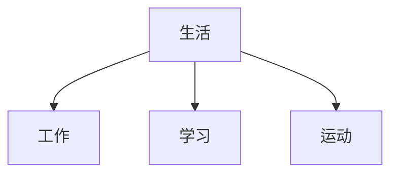

# 生活的组成
工作、学习、运动

## 对工作的理解
工作为什么是生活的一部分，因为工作占了我们大部分的时间，通过劳动人们才能生存，所以工作或者说劳动就是我们生活的一部分，每个人都都是需要劳动的，正视劳动会对我们的职业选择或者工作方向有一点的益处。

## 对学习的理解
当我们解决了生存的问题，工作之余我们可以花一点时间在学习上面。具体该如何学习，这是一个值得思考的问题。
首先，对学习最直接的体现就是看自己工作相关的书籍，学了相关知识可以用在工作上，不懂的继续看，看了继续实践，以此反复，这类可以归类为技术书籍；
其次，可以看人文类的书籍，通过历史了解事情的来龙去脉，就像语文课上的讲的故事背景，有了背景的依托在讲课文；通过哲学认识自己，认识事物的本质，举例：小刀，小时候我们知道小刀可以用来削铅笔，削苹果，那小刀的本质是什么？其实小刀的本质是锋利，那你怎么知道小刀锋利的，需要靠实践才知道；那当我们认识到事物的本质有什么好处，当你认识的到事物的本质好处就是你知道不是小刀可以削苹果而是锋利的事物可以削苹果，你造出一个锋利的事物，取名大刀也可以削苹果；中国古代哲学提到的形而上者谓之道，形而下者谓之器，道是抽象的，像小刀的锋利，器就是小刀，你懂得了道自然就能知道器。中西方哲学都可以学习，中哲让你明白人何以为人，西哲让你探索知识，中西方哲学之间不是二元对立的。
最后，可以看自然科学类的书籍，看看西方国家是如何研究世界的。 有了哲学背景，看自然科学类的书籍会让你更好的去思考。

## 对运动的理解
除了学习之余，有时间可以多运动，运动除了锻炼身体，还可以让我们明白一个道理，那就是熟能生巧，竞技类运动都是一个动作练上好多遍才能做到行云流水般的流畅。
跑步前期的时候有点难坚持，但是等你坚持一段时间后就会上瘾了。
球类运动，看似动作很流畅，其实背后不知道练了多少次才能打到的。
个人认为运动是一个容易上瘾的活动，能长期坚持运动，其实就是上瘾了，只是习惯上说爱好运动，长期运动的人，一下不运动的话身体是会不舒服的，总感觉少了点什么。

# 介绍自己的工作、学习、运动

